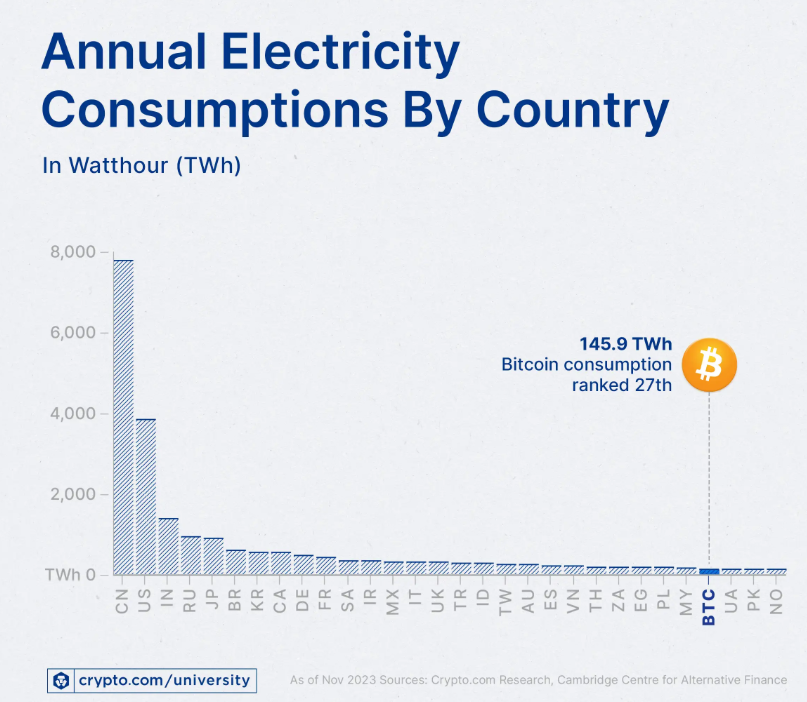
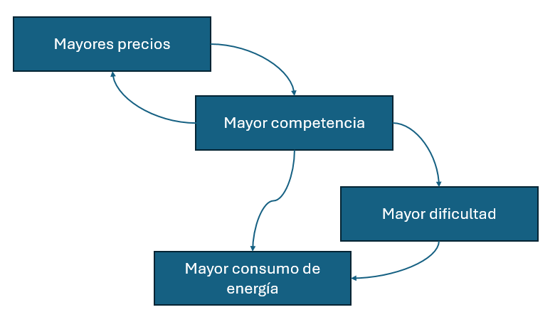

```{r setup, include=FALSE}
knitr::opts_chunk$set(echo = FALSE)
library(tidyverse)
library(ggplot2)
library(readr)
library(scales)
```

```{r}
# Load and prepare data
df <- read_csv("../Output/model_simulation_bitcoin.csv")

# Filter scenarios of interest
df_comp <- df %>%
  filter(Run.ID %in% c(1, 3001, 3002), time <= 2200)
```

## El Impacto del Bitcoin en el Uso de Energía Fósil



#### Introducción

En 2008 se publicó un documento llamado “Bitcoin: A Peer-to-Peer Electronic Cash System”, el autor era Satoshi Nakamoto. En este documento, Nakamoto propuso un esquema para realizar pagos electrónicos, sin la participación de terceros en el proceso de una transacción. Lo anterior lo lograba con base en el uso de criptografía para que los usuarios pudieran realizar las transacciones de manera pseudo-anónima. Esta publicación dio origen al primero criptoactivo llamado Bitcoin, donde en enero 2009 se realizó la primera implementación del esquema Bitcoin introduciendo el primer bloque de la cadena, llamado bloque génesis.

El origen del Bitcoin representó un hito histórico, a partir del cual surgieron otros activos con esquemas similares. Este criptoactivo alcanzó su precio máximo el 22 de mayo de 2025, con un valor de 111,891.3 dólares por unidad (Coinbase, 2025). Sin embargo, además de las críticas de alta volatilidad que presenta este activo, su esquema de validación en la que no requiere la participación de terceros se realiza a través de un proceso llamado prueba de trabajo ("proof of work"), el cual es altamente internsivo en el uso de energía.

En 2025, el consumo anual de energía de Bitcoin ascendió a 175.9 TWh, lo que equivale a la demanda eléctrica anual de países de tamaño mediano como Argentina, los Países Bajos o Polonia; asimismo, su huella de carbono es comparable a la de países como Qatar, con emisiones estimadas en alrededor de 98 MtCO₂ por año (Digiconomist, 2025; Cambridge Centre for Alternative Finance, 2025). El presente análisis evalúa el impacto del Bitcoin en el escenario actual, y presenta un contrafactual en el que se considera el cambio en el uso de energías fósiles si a nivel global se hubiera implementado un impuesto al consumo de estas energías para el mercado de Bitcoin.

#### El dilema del bitcoin

El dilema del Bitcoin fue propuesto por Colin (2022), quien argumenta que la alta competencia dentro del sistema, es decir, la constante búsqueda de recompensas en el ecosistema, impulsa un creciente consumo de energía. Según su análisis, este consumo no se detendrá ni con avances tecnológicos ni con un mayor suministro de energía limpia. Esto se debe a que el diseño actual de Bitcoin es inherentemente contradictorio: para garantizar la seguridad del ecosistema se utiliza un mecanismo conocido como prueba de trabajo, el cual requiere un uso intensivo de energía. A medida que las máquinas se vuelven más eficientes en resolver este mecanismo, su complejidad aumenta, lo que incrementa las demandas computacionales y energéticas. Además, el alza en el precio del Bitcoin genera mayores incentivos para que más participantes se sumen a la red, lo que a su vez incrementa aún más el consumo energético.



El ecosistema de Bitcoin genera impactos ambientales y sociales debido a que su alta demanda energética lo convierte en un consumidor masivos de electricidad. Goodkind et al. (2020) encontraron que por cada dólar generado en minería de Bitcoin en Estados Unidos se producen 0.49 dólates en daños climáticos asociados al costo social de la huella de carbono y salud humana relacionados con la contaminación. Dado el crecimiento en capitalización de mercado de este activo, resulta relevante reabrir la discusión sobre su impacto ambiental, y evaluar el contrafactual para considarar políticas potenciales hacia este sector.

####   Evaluación con base en EDIAM

EDIAM es un modelo dinámico de equilibrio general construido por Molina (2022) con el objetivo de analizar los efectos de la innovación y políticas climáticas en la transición energética. Este incluye dos regiones, los países del norte o desarrollados, y los países del sur o en vías de desarrollo; además, incluye tres sectores (el de energía primaroa, secundaria y tecnológico); y considera cuatro agentes (consumidores, productores de energía, productores de tecnologías y emprendedores). Por lo tanto, bajo ciertos supuesto, se puede evaluar qué hubiera pasado si se hubieran implementado medidas que restringiera el uso intensivo de energía fósil en el ecosistema bitcoin.

En este caso se evaluaron tres escenarios:

1.  El escenario actual, donde se considera que este ya incluye el uso intensivo de energía por el ecosistema de bitcoin.

2.  El escenario hipotético moderado:

    -   Se asume un impuesto al consumo de energía fósil, motivado, principalmente, de un acuerdo internacional donde ambas regiones acuerdan establecer un impuesto para reducir el consumo por bitcoin.

    -   Se realizan algunos ajustes a las variables inciales. La elasticidad de sustitución entre energía limpia y fósil aumenta de 3 a 3.5. La propensión a innovar en energía limpia aumenta de 0.02 a 0.02. Los retornos a la innovación aumentan de 0.25 a 0.5. Y se asume que de haberse incorporado el impuesto anteriormente, el consumo incial de energía fósil sería menor.

3.  El escenario hipotético extremo:

    -   Los supuestos al moderado son similares, sin embargo, aumentan aún más los parámetros iniciales.

A continuación se presentan los resultados sobre la transición energética de los tres escenarios. Se puede observar que en el escenario actual la energía fósil tiene una tendencia creciente, mientras que la energía limpia permanece prácticamente sin cambios. Resulta interesante contrastar el escenario moderado con el extremo debido a que en ambos casos los resultados son bastante alentadores, demostrando que si bien el escenario extremo refleja un mayor cambio en la reducción de energía fósil, el escenario moderado pareciera ser un escenario suficientemente bueno para lograr una transición egenergética.

```{r}
df_comp %>%
  filter(time <= 2100) %>%
  group_by(Run.ID, time) %>%
  summarise(Yce = mean(Yce), Yre = mean(Yre), .groups = "drop") %>%
  pivot_longer(cols = c(Yce, Yre), names_to = "Technology", values_to = "Production") %>%
  mutate(Technology = recode(Technology, 
                             "Yce" = "Energía Fósil", 
                             "Yre" = "Energía Limpia")) %>%
  ggplot(aes(x = time, y = Production, color = Technology)) +
  geom_line(size = 1.3) +
  facet_wrap(~Run.ID, labeller = labeller(Run.ID = c(
      "1" = "Escenario Actual",
      "3001" = "Escenario Moderado",
      "3002" = "Escenario Extremo"
  ))) +
  scale_color_manual(values = c("Energía Fósil" = "#e74c3c", 
                                "Energía Limpia" = "#27ae60")) +
  labs(
    title = "Transición Energética",
    x = "Año", 
    y = "Producción de Energía", 
    color = "Tipo de Energía"
  )
```

Asimismo, es interesante evaluar los resultados obtenidos de los escenarios sobre el cambio en temperatura. En particular, se puede obervar que el escenario extremo resulta en un mayor incremento en temperatura, la cual rebasa el límite establecido en los acuerdo de París. Este resultado, aunque contraintuitivo se puede explicar debido a las relaciones no lineales del modelo, que permite flexibilidad y que diversos factores interactúen entre sí. Si bien este fenómeno deberá ser evaluado con mayor detenimiento, esto se podría dar porque una mayor innovación podría llevar a una reducción en los costos de producción, incentivando un mayor consumo general de energía.

```{r}

df_comp %>%
  group_by(Run.ID, time) %>%
  summarise(Delta.Temp = mean(Delta.Temp), .groups = "drop") %>%
  ggplot(aes(x = time, y = Delta.Temp, color = factor(Run.ID))) +
  geom_line(size = 1.5) +
  geom_hline(yintercept = 2, linetype = "dashed", color = "#e74c3c", size = 1) +
  geom_hline(yintercept = 1.5, linetype = "dotted", color = "#f39c12", size = 1) +
  scale_color_manual(
    values = c("1" = "#95a5a6", "3001" = "#27ae60", "3002" = "#f39c12"),
    labels = c(
      "1" = "Escenario Actual",
      "3001" = "Escenario Moderado",
      "3002" = "Escenario Extremo"
    )
  ) +
  labs(
    title = "Comparativo de Cambios de Temperatura",
    x = "Año",
    y = "Incremento en Temperatura (°C)",
    color = "Scenario",
    caption = "Línea Roja: 2°C límite del Acuerdo de Paris"
  ) +
  guides(color = guide_legend(title.position = "top"))
```

#### Conculsiones

Aunque el diseño de Bitcoin es innovador, ha generado un elevado consumo de energía con un impacto significativo en la huella de carbono. Actualmente, se argumenta que el uso intensivo de energía por parte de esta red no solo contribuye a la contaminación, sino que ha llevado a que plantas de energía fósil que debían haber cerrado continúen operando para satisfacer la alta demanda energética del ecosistema.

Una posible forma de incentivar la transición de esta red hacia fuentes limpias consiste en introducir un impuesto generalizado a la energía fósil. Este escenario se evalúa en el presente estudio, donde con base en el modelo EDIAM se encuentra que dicha política tiene efectos relevantes tanto en la transición energética como en el incremento de la temperatura global.

Si bien estos resultados podrían considerarse alentadores desde una perspectiva de política pública, la implementación de un impuesto generalizado sigue siendo una propuesta poco viable políticamente y que requiere ser analizada con mayor profundidad.

#### Limitantes y Trabajo Futuro

El presente análisis se basa en un modelo que busca representar de forma abstracta y simplificada ciertos aspectos de la realidad. No obstante, como ocurre con cualquier modelo, no todas las variables relevantes pueden ser incluidas, aunque sí permite evaluar algunas características clave del sistema en estudio.

Cabe señalar que la evaluación presentada parte de un supuesto altamente simplificado: la aplicación de un impuesto generalizado sobre toda la energía fósil. Sin embargo, para analizar de manera más precisa el impacto del consumo energético del ecosistema Bitcoin, sería necesario modelarlo como un sector específico que demanda tanto energía fósil como energía limpia, incorporando además los patrones observados de crecimiento en su consumo energético.

Bajo este enfoque, sería posible considerar la aplicación de un impuesto dirigido exclusivamente al consumo energético asociado al ecosistema Bitcoin, una medida que podría tener mayor factibilidad política en foros internacionales y resultar más alineada con los principios de equidad y eficiencia en política ambiental.

#### AI Engagement

<https://chatgpt.com/share/6869f93c-52f0-800a-a4f0-256f50002a01>

#### Bibliografía

Cambridge Centre for Alternative Finance. (2025). *Cambridge Bitcoin Electricity Consumption Index (CBECI)*. University of Cambridge. <https://ccaf.io/cbeci>

Coinbase. (2025, mayo 22). *Bitcoin hit its all‑time high of \$111,891.30* [Captura de precio histórico]. Coinbase. Consultado el 27 de junio de 2025, de <https://www.coinbase.com/price/bitcoin>

Goodkind, A. L., Jones, B. A., Berrens, R. P., & Talberth, J. M. (2020). Cryptodamages: Monetary value estimates of the air pollution and human health impacts of cryptocurrency mining. *Energy Research & Social Science*, 59, 101281. https://doi.org/10.1016/j.erss.2019.101281

Digiconomist. (2025). *Bitcoin Energy Consumption Index*. <https://digiconomist.net/bitcoin-energy-consumption/>

Molina, E. (2022). *A dynamic model for analyzing environmental directed international technological change*. Instituto Tecnológico y de Estudios Superiores de Monterrey (ITESM). Manuscrito no publicado.

Nakamoto, S. (2008). Bitcoin: A peer-to-peer electronic cash system. <https://bitcoin.org/bitcoin.pdf>

Read, C. L. (2022). *The Bitcoin dilemma: Weighing the economic and environmental costs and benefits*. Springer. https://doi.org/10.1007/978-3-031-09138-4
